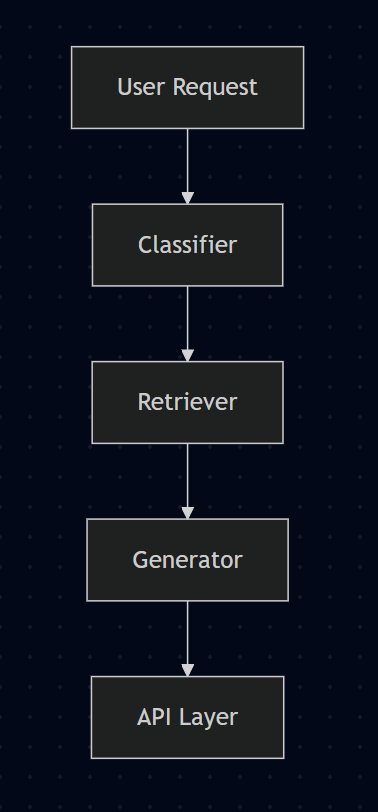

# 🧠 CodeMaster Reasoning Pipe

**Version:** 0.0.1  
**Author:** Michael Edekin  
**Email:** [michealedekin@gmail.com](mailto:michealedekin@gmail.com)  
**LinkedIn:** [@michael](https://www.linkedin.com/in/michaeledekin/)

**Live app Link:**  [https://helpdesk-system-three.vercel.app/](https://helpdesk-system-three.vercel.app/)
---
<video controls src="bandicam 2025-06-30 08-17-29-776.mp4" title="Title"></video>


# Intelligent Help Desk System

An end-to-end, production‑ready AI-powered help desk pipeline that classifies user requests, retrieves relevant knowledge, and generates contextual responses.

---

## Table of Contents

1. [Introduction](#introduction)
2. [Features](#features)
3. [Architecture Overview](#architecture-overview)
  * [Component Implementation Details](#Component-Implementation-Details)
  * [Approach & Workflow](#Approach-Workflow)
4. [Prerequisites](#prerequisites)
5. [Installation](#installation)
6. [Configuration](#configuration)
7. [Building the Knowledge Index](#building-the-knowledge-index)
8. [Running the Application](#running-the-application)

   * [Local Development](#local-development)
   * [Docker Deployment](#docker-deployment)
9. [API Usage](#api-usage)
10. [Testing](#testing)
11. [Logging & Monitoring](#logging--monitoring)
12. [Troubleshooting](#troubleshooting)
13. [Contributing](#contributing)
14. [License](#license)

---

## Introduction

This project implements a modular help desk system powered by AI components:

* **Classification**: Categorizes incoming requests using semantic embeddings.
* **Retrieval**: Searches a local knowledge base via FAISS vector search.
* **Generation**: Creates clear, step-by-step responses via Azure OpenAI chat completions.
* **API**: Exposes a REST interface for integration with chatbots or web clients.

## Features

* **Semantic Classification**: Uses `SentenceTransformers` (`all-MiniLM-L6-v2`) for embedding category descriptions and user queries.
* **Escalation Rules**: Automatically flags low-confidence or trigger keyword requests for human intervention.
* **Efficient Retrieval**: FAISS-backed nearest-neighbor search over Markdown/JSON documents.
* **Customizable Prompting**: Easily tweak system instructions and retrieval context in `app/prompts/builder.py`.
* **Azure OpenAI Integration**: Pluggable chat deployment via environment configuration.
* **FastAPI Server**: Zero‑boilerplate REST API with interactive Swagger docs.
* **Robust Testing**: Pytest suites and smoke tests cover all pipelines.

## Architecture Overview





Components are separated into `app/services`, `app/retrieval`, `app/embedding`, and `app/api` for maintainability.


## Component Implementation Details

This focused overview of how each core component in the help desk system is implemented, including the algorithms and file locations.


## Approach & Workflow

1. **Request Classification**

   * Embed incoming user requests and predefined category descriptions using `SentenceTransformers` (`all-MiniLM-L6-v2`).
   * Compute cosine similarity between the request embedding and each category embedding to select the best match.
   * Apply escalation rules based on confidence thresholds and trigger keywords.

2. **Knowledge Retrieval**

   * Preprocess documents (`.md`/`.json` in `data/`) into overlapping text chunks.
   * Embed each chunk and build a FAISS index for efficient k-NN search.
   * At query time, embed the user’s request and retrieve the top‑k most similar chunks.

3. **Response Generation**

   * Build a system prompt by combining:

     * A fixed system instruction (expert IT help desk assistant).
     * Classification summary (label, confidence, escalation flag).
     * Retrieved context snippets with source metadata.
     * The original user query.
   * Invoke OpenAI’s chat completion endpoint with controlled parameters to produce the final answer.

4. **Escalation Logic**

   * Flag requests for human review if:

     1. The top category similarity falls below `ESCALATION_THRESHOLD`.
     2. The request contains trigger words (e.g., “urgent”, “ASAP”) that exceed their own trigger thresholds.


## 1. Request Classification

* **Module**: `app/services/classifier.py`
* **Initialization**:

  ````python
  # Load and embed categories
  self.category_embeddings = {}
  self.trigger_embeddings = {}

  for cat, props in self.categories.items():
      description = props.get("description", "")
      self.category_embeddings[cat] = embed_text(description)

      triggers = props.get("escalation_triggers", [])
      self.trigger_embeddings[cat] = [embed_text(t) for t in triggers]
  ````
* **Prediction**:

  ````python
  text_emb = embed_text(text)

  # Classify via semantic similarity to category description
  similarities = {
      cat: cosine_similarity([text_emb], [emb])[0][0]
      for cat, emb in self.category_embeddings.items()
  }
  label = max(similarities, key=similarities.get)
  confidence = similarities[label]

  # Check escalation
  escalate = self._should_escalate(label, text_emb, confidence)

  return label, confidence, escalate
  ````
* **Escalation Check**:

  ````python
  # High semantic similarity to any escalation trigger
  trigger_embs = self.trigger_embeddings.get(label, [])
  for trig_emb in trigger_embs:
      trig_sim = cosine_similarity([text_emb], [trig_emb])[0][0]
      if trig_sim >= self.trigger_threshold:
          return True

  return False
  ````

---

## 2. Knowledge Retrieval

* **Index Building**:

  * **File**: `scripts/build_index.py`
  * **Process**: Load `.md` and `.json`, split into \~200-token overlapping chunks via `chunk_text()` in `app/retrieval/chunking.py`, embed chunks, and write FAISS index + metadata.

* **Query Search**:

  ````python
  # Embed the query
  q_emb = embed_text([user_query])[0]
  # Search FAISS
  distances, indices = faiss_index.search(q_emb.reshape(1, -1), k)
  results = [metadata[i] for i in indices[0]]
  ````

---

## 3. Response Generation

* **Prompt Construction**:

  * **File**: `app/prompts/builder.py`
  * **Logic**: Combine a fixed system message, classification details, retrieved snippets, and the original question into one prompt.

* **LLM Call**:

  * **Code**:

  ````python
  response = azure_client.chat.completions.create(
      deployment_name=settings.AZURE_DEPLOYMENT_NAME,
      messages=prompt_messages,
      temperature=0.2,
      max_tokens=512
  )
  answer = response.choices[0].message.content.strip()
  ````

---

## 4. Escalation Logic

* **File**: `app/services/classifier.py`
* **Details**: Implemented in the `_should_escalate()` method, checking both confidence and trigger thresholds as described above.  

---

## Prerequisites

* **Python 3.10+**
* **git**, **pip**, and a virtual environment tool
* **OpenAI**
* **FastAPI**
* **Faiss**

## Installation

1. **Clone the Repository**

   ```bash
   git clone https://github.com/micheal0034/helpdesk-system.git
   
   cd helpdesk-system
   ```

2. **Create & Activate Virtual Environment**

   ```bash
   python -m venv venv
   source venv/bin/activate    # macOS/Linux
   venv\Scripts\activate     # Windows
   ```
3. **Install Dependencies**

   ```bash
   pip install -r requirements.txt
   ```

## Configuration

1. **Create a `.env` file** in the project root with the following keys:

   ```ini
   AZURE_OPENAI_NAME="AzureAI"
   AZURE_DEPLOYMENT_NAME="<your-deployment-name>"
   AZURE_OPENAI_KEY="<your-key>"
   AZURE_OPENAI_ENDPOINT="https://<your-endpoint>.openai.azure.com"
   AZURE_OPENAI_API_VERSION="2023-09-01-preview"
   INDEX_PATH="data/faiss.index"
   CATEGORIES_PATH="app/models/categories.json"
   DATA_DIR="uploads"
   ```
2. **Verify Settings Loader**
   The `app/core/config.py` script will load and validate all required vars on startup.

## Building the Knowledge Index

Before serving requests, build the FAISS index:

```bash
python run_indexer.py
```

This will scan `data/*.md` and `data/*.json`, chunk text, embed, and write `data/faiss.index` and its metadata.

## Running the Application

### Local Development

1. **Start the FastAPI Server**

   ```bash
   uvicorn app.main:app --reload --host 127.0.0.1 --port 8001
   ```
2. **Access the API**

   * Swagger UI: `http://localhost:8001/docs`
   * Redoc: `http://localhost:8001/redoc`

### Online Deplyment

Live app Usage: `https://helpdesk-system-three.vercel.app/`

## API Usage

### Endpoints

- **POST** `/classify`
  - Payload: `{ "text": "Issue description" }`
  - Response: `ClassificationResult` JSON

- **POST** `/retrieve`
  - Payload: `{ "text": "Your query" }`
  - Response: `RetrievalResult` snippets

- **POST** `/helpdesk`
  - Payload: `{ "text": "Help me with ..." }`
  - Response: `HelpResponse` containing classification, snippets, and answer

### Example (cURL)
```bash
curl -X POST http://localhost:8001/helpdesk \
     -H "Content-Type: application/json" \
     -d '{"text":"I forgot my password"}'
````

## Testing

Run the full test suite with pytest:

```bash
pytest -q
```

**Test Results**:

````
============================= test session starts =============================
collected 6 items

tests/test_helpdesk_service.py .                                        [ 20%]
tests/test_retriever.py .                                               [ 40%]
tests/test_api.py .                                                     [ 60%]
tests/test_classifier.py .                                              [ 80%]
tests/test_generator.py .                                               [100%]

============================== 6 passed in 0.73s ==============================
````

## Logging & Monitoring

- **Structured Logging**: Standard Python `logging` configured in each component.
- **Timing Metrics**: Each pipeline stage logs duration for performance tuning.
- **Log Level**: Set `LOG_LEVEL` in environment (default INFO).

## Troubleshooting

- **Index Not Found**: Ensure `data/faiss.index` exists or rebuild via `build_index.py`.
- **Env Vars Missing**: Review `.env` and confirm keys; startup will error if required vars are unset.
- **Azure Errors**: Verify deployment name and key in Azure portal.

## Contributing

1. Fork the repo and create a feature branch.
2. Write tests for new functionality.
3. Submit a pull request with clear descriptions.

## License

This project is licensed under the MIT License.


